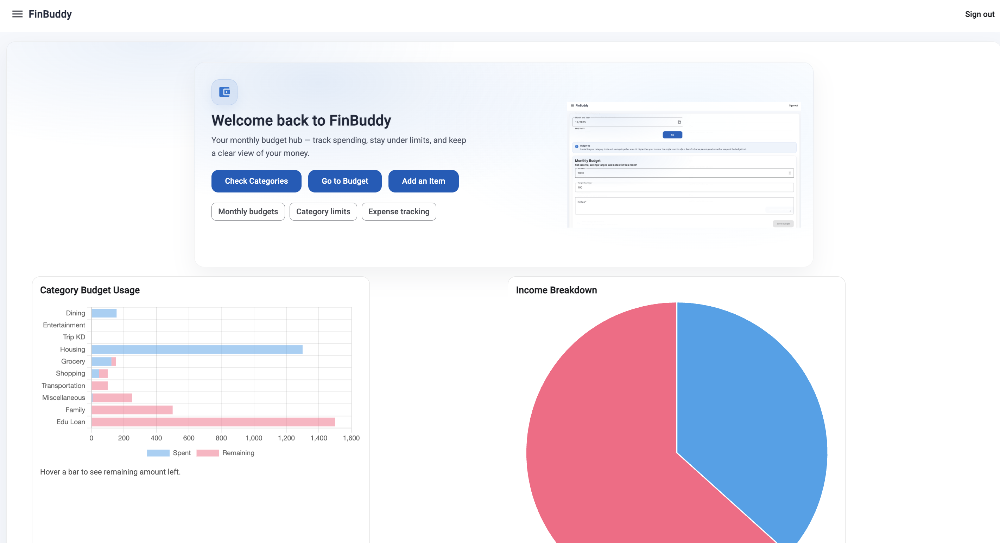

# Angular Workspace 🅰️

A collection of Angular applications and experiments

## Overview

This repository is an **Angular workspace** designed to host multiple Angular-based applications and experiments over time.  
Each project in this workspace focuses on different concepts, architectures, and real-world use cases built using Angular.

At the moment, the workspace contains **one primary project**:

# FinBuddy 💸

A Personal Finance & Monthly Budgeting Application



## Overview

**FinBuddy** is a personal finance and budgeting application built using **Angular, TypeScript, and Angular Material**.

The application helps users:

- Plan monthly budgets
- Track category-wise spending
- Visualize expense distribution
- Generate AI-powered financial insights

The focus of this project is on:

- Clean architecture
- Scalable feature design
- State Management
- Typed API contracts
- Real-world budgeting workflows

---

## Key Features

### 1️⃣ Authentication

- Secure **JWT-based authentication**
- User-specific data isolation
- Protected routes and API endpoints

### 2️⃣ Categories

- Users manage their own spending categories
- Categories are reusable across months
- Categories can be activated or archived (instead of permanent deletion)

### 3️⃣ Monthly Budgets

- Budgets are created per month (`YYYY-MM`)
- Each month includes:
  - Monthly income
  - Optional savings target
  - Spending limits per category
- If a previous month exists, category limits are intelligently cloned

### 4️⃣ Expense Tracking (Items)

Users can log monthly expenses with:

- Date of purchase
- Category
- Amount
- Item name
- Optional merchant
- Optional notes

Expenses dynamically update budget tracking and analytics.

### 5️⃣ 📊 Monthly Charts & Visual Insights

FinBuddy includes interactive charts to help users understand their spending patterns:

- **Bar Chart** → Category-wise monthly expense comparison
- **Pie Chart** → Expense distribution across categories

Charts update dynamically based on the selected month and provide:

- Clear breakdown of spending proportions
- Overspending visibility
- Visual comparison of spending behavior

### 6️⃣ 🤖 AI-Powered Monthly Insights

FinBuddy integrates **OpenAI's `gpt-4o-mini` model** to generate intelligent monthly summaries.

Using structured data from:

- Monthly budget
- Category limits
- Actual expenses

The system generates:

- Natural-language financial summaries
- Overspending analysis
- Savings behavior insights
- Suggestions for improvement

---

## Planned Enhancements (Work in Progress)

### 1. AI-Chat Interface

Conversational interface to ask:

- “How did I perform this month?”
- “Where am I overspending?”
- “How can I optimize my budget?”

### 2. Receipt Upload & Auto-Expense Creation

- Upload receipt images directly
- Extract expense details from receipts
- Automatically create expense entries in the database

### 3. Implement OAuth

- Add OAuth2

---

## Tech Stack

### Frontend

- Angular
- TypeScript
- Angular Material
- Reactive Forms
- Angular Signals
- NgRx (Store & Effects)
- RxJS

### Backend

- Node.js
- REST APIs
- JWT Authentication
- Prisma ORM
- PostgreSQL

> The backend implementation and database schema are available in the GitHub repository: https://github.com/Devadharshini-Nagarajan/FinBuddy-NestJS

---

## Architecture Highlights

- Strong separation between **frontend models** and **database schema**
- Typed APIs and state management
- Scalable structure suitable for future features like AI integration
- Designed with real-world budgeting workflows in mind
- Configured automated pre-commit checks (linting, formatting, and type validation) to enforce consistent code quality before merges
- Established a structured developer pull request workflow with mandatory reviews and CI validation

---

## Repository

Backend and related services can be found in the GitHub repository associated with this project.

---

## Steps to Explore the Application

### Prerequisites

- Node.js (v18+ recommended)
- npm
- Angular CLI

### 1. Clone the Repository

```bash
git clone <repository-url>
cd angular-workspace
```

### 2. Install Dependencies

```bash
npm install
```

### 3. Start the FinBuddy Application

```bash
npm run start:finbuddy
```

### 4. Access the Application

```bash
http://localhost:4200
```
